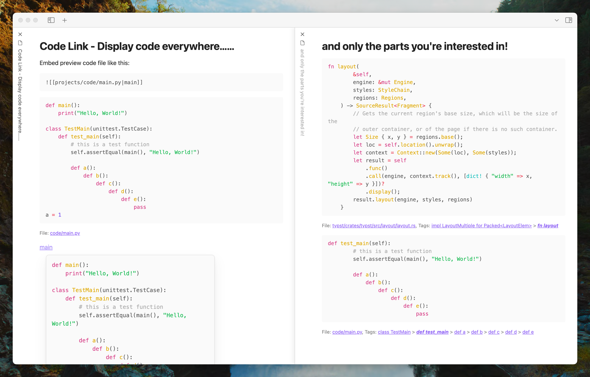
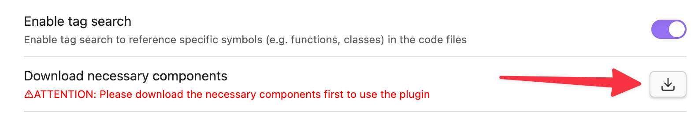
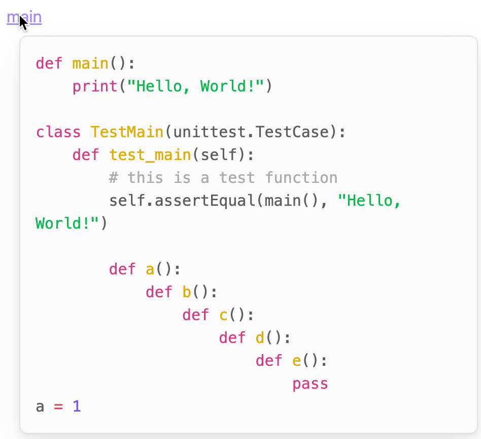
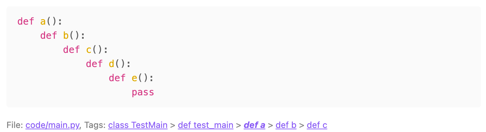
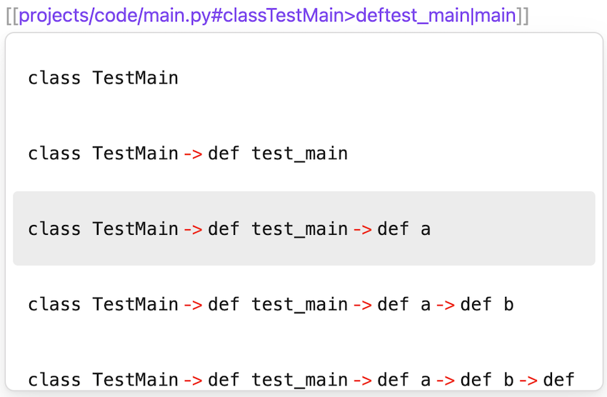

# Obsidian Code Link

  
 

[ [English](./README.md) | [简体中文](./README-CN.md) ]

Display code in Obsidian, and only the part you're interested in!

- **Link to code files** as you would link to notes, and you can **preview their contents**. 
- Even better, through symbol search/tag search/code outline (or whatever you want to call it.), you can **link directly to a specific symbol in the code file** (such as a class, a function, or a method within a class). 

By creating links with symbols, you can reference only the code parts that interest you in your notes and avoid distractions from other content. This is particularly useful when taking code notes (for example, when studying a complex open-source project).

# ⚠️ATTENTION 

- To be able to link to the code file with internal link, make sure that the **Settings - Files and Links - Detect all types of files** option are enabled.
- **Embed preview only works in reading view**, so if you find that the preview is not displayed, please **switch to reading view** by pressing `Ctrl/Cmd + E`.
- Before you perform a tag search, make sure that Settings - Code Link - **Enable tag search option** is enabled and **necessary components have been downloaded** (by clicking the Download necessary components button).

    

# Usage

1. Create a folder in your obsidian repository for storing imported projects of your code projects, the default path is `projects`.
2. Open Command Palette and run `Code Link: Import project`, select the project folder you want to import (see [this section](#import-project-into-obsidian-vault) below), then the project will be imported into the folder you created in step 1.
3. Open editor, link to the code file just like linking to a note, then you can preview the code in the editor. 

# Code Preview

Supports both hover preview and embed preview of the code file.

    

    

Below the embed preview lists the link to the referenced code file, and the tag path to the current symbol (e.g., if you link to a method named `methodB` in a class named `ClassA`, the tag path is `class ClassA > def methodB`). When you click on a symbol in the tag path, the embed preview will temporarily switch the content of the displayed code to the content of that symbol.

# Tag Search

**Place the cursor behind the code link** (e.g. `[[main.py]]|`, where `|` is the cursor) will trigger tag search. The code link will be replaced when the specified symbol is selected in the tag search.

    

This feature is implemented with the help of [TreeSitter](https://tree-sitter.github.io/tree-sitter/) and [`.scm` files from the zed editor](https://zed.dev/).

If you want more languages to be supported, please consider writing tree-sitter queries for other languages modeled after [existing `.scm` files](https://github.com/observerw/obsidian-code-link/tree/main/src/lang/data/scm) and open a pull request. I would appreciate that!

# Import Project Into Obsidian Vault

Obsidian only allows to link to files within the vault, so you need to import the project into your vault before you can link to it.

To import a project, open command palette and run `Code Link: Import project`, then select the project folder you want to import. The project will be imported into the projects folder.

Note that "import" means create a symbol links (or file shortcuts in Windows) to the original files. Symlinks are just a reference to the original file, so if you delete the original file, the symlink will be broken.